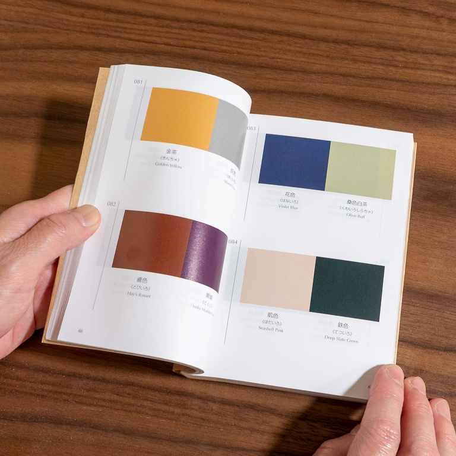
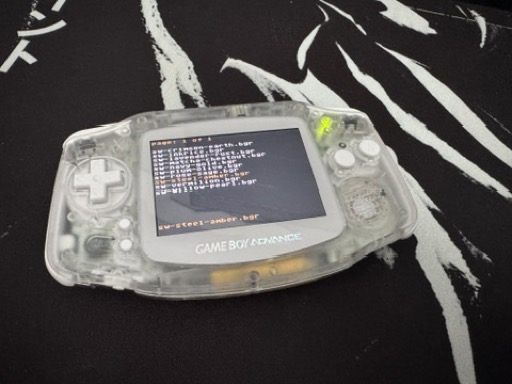

# EDGBA PRO: Sanzo Wada

A menu theme for the EverDrive GBA PRO using 2–3 colors from a traditional
Japanese combination, inspired by *A Dictionary Of Color Combinations Vol 1*
by Sanzo Wada.

  
  

## Install

1. Download the [latest release](https://github.com/rlcodi/edgba-pro-sanzo-wada/releases/latest).
2. Copy the `Sanzo Wada` folder to `/edgba/themes/` on the SD card.
3. Boot the cart, open the Themes folder, highlight a theme, then select and
   set theme.

## Themes

| Theme | Combination | Swatches |
|------|-------------|----------|
| `sw-crimson-navy.bgr` | Suo & Kon: Crimson & Navy (Deep red, navy, pale blue) | 

 |
| `sw-bushclover-pampas.bgr` | Hagi & Susuki: Bush Clover & Pampas Grass (Muted pink, warm beige) | 

 |
| `sw-chrysanthemum-forget.bgr` | Kiku & Wasurenagusa: Chrysanthemum & Forget-me-not (Gold, dusty blue) | 

 |
| `sw-coral-pearl.bgr` | Sango & Shinju: Coral & Pearl (Coral pink, warm pearl) | 

 |
| `sw-crimson-earth.bgr` | Ake & Cha: Deep Red & Brown (Deep red, brown, warm cream) | 

 |
| `sw-crimson-gold.bgr` | Kurenai & Kin: Crimson & Gold (Rich red, regal gold) | 

 |
| `sw-gray-sprout.bgr` | Kawari-nezumi & Moegi: Mouse Gray & Sprout Green (Warm gray, bright green) | 

 |
| `sw-ibis-vermillion.bgr` | Toki & Hiwada: Crested Ibis & Light Orange (Pinkish coral, pale orange) | 

 |
| `sw-indigo-brown.bgr` | Ai & Cha: Indigo & Brown (Deep blue, warm brown) | 

 |
| `sw-indigo-gold.bgr` | Asagi & Yamabuki: Pale Indigo & Golden Yellow (Light blue, gold) | 

 |
| `sw-inkrice.bgr` | Sumi & Shiromushi: Ink & White Rice (Charcoal, warm off-white) | 

 |
| `sw-lapis-white.bgr` | Ruri & Shiro: Lapis Lazuli & White (Brilliant blue, silver) | 

 |
| `sw-lavender-rust.bgr` | Fuji & Kuchiba: Wisteria & Autumn Leaves (Lavender, burnt orange, warm) | 

 |
| `sw-matcha-chestnut.bgr` | Matcha & Kuri: Green Tea & Chestnut (Matcha green, chestnut brown, cream) | 

 |
| `sw-navy-gold.bgr` | Kon & Kariyasu: Deep Blue & Muted Gold (Navy, cream, gold accents) | 

 |
| `sw-peach-plum.bgr` | Momo & Ume: Peach & Plum (Soft peach, plum) | 

 |
| `sw-peony-herb.bgr` | Botan & Shakuyaku: Peony & Herb Peony (Rose pink, pale green) | 

 |
| `sw-persimmon-chestnut.bgr` | Kaki & Kuri: Persimmon & Chestnut (Burnt orange, chestnut brown) | 

 |
| `sw-pine-chestnut.bgr` | Matsuba & Cha: Pine Needle & Brown (Deep green, warm brown) | 

 |
| `sw-pink-gold.bgr` | Nadeshiko & Yamabuki: Carnation & Kerria (Soft pink, golden yellow) | 

 |
| `sw-plum-olive.bgr` | Murasaki & Uguisu: Purple & Olive Green (Plum, olive, muted lavender) | 

 |
| `sw-plum-pine.bgr` | Ume & Matsu: Plum & Pine (Winter plum, forest green) | 

 |
| `sw-redbean-white.bgr` | Azuki & Shiro: Red Bean & White (Sweet bean red, cream) | 

 |
| `sw-rose-sage.bgr` | Toki & Moegi: Crested Ibis & Sprout Green (Soft pink, sage green, light) | 

 |
| `sw-sakura-sprout.bgr` | Wakaba & Sakura: Fresh Green & Cherry Blossom (Green, pale pink) | 

 |
| `sw-steel-amber.bgr` | Sabitetsu & Hana-iro: Rust Iron & Blue (Steel blue, amber, cool) | 

 |
| `sw-tea-forest.bgr` | Cha & Midori: Brown & Green (Tea brown, deep forest green) | 

 |
| `sw-vermilion.bgr` | Benihi & Asagi: Safflower Red & Pale Indigo (Deep crimson, pale indigo, amber) | 

 |
| `sw-violet-dandelion.bgr` | Sumire & Tanpopo: Violet & Dandelion (Purple, bright yellow) | 

 |
| `sw-willow-pearl.bgr` | Yanagi & Shinju: Willow & Pearl (Sage, pearl, muted) | 

 |
